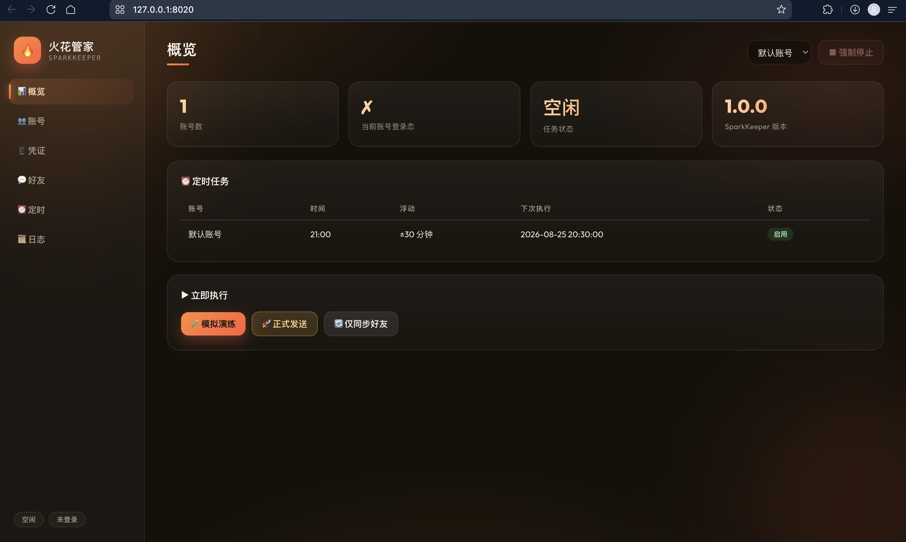
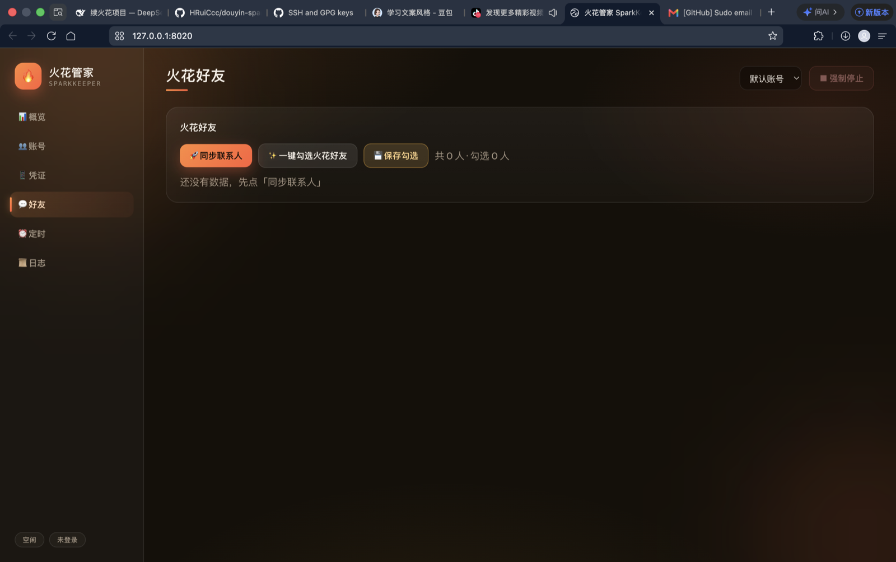
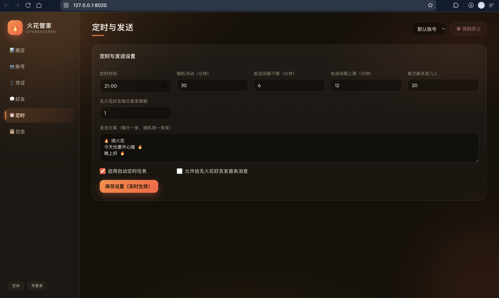

# 火花管家 SparkKeeper 🔥

抖音自动续火花系统（自主实现）。用一台常开的电脑 / 云服务器，每天在你设定的时间自动给选中的火花好友发一条消息，把「火花 · 连续聊天天数」一直养下去——不用每天定闹钟手动发。

## 界面截图

**概览**



**火花好友**



**定时与发送**



## 功能

- **图形化网页控制台**：概览 / 账号 / 凭证 / 好友 / 定时 / 日志 六大模块
- **手机扫码登录**：网页生成二维码，抖音 App 扫码即登录，凭证保存在本地
- **多账号隔离**：每个账号独立数据目录、独立登录态、独立定时任务
- **火花好友管理**：一键同步联系人（含火花天数），一键勾选火花好友
- **定时发送**：每天定时 + 随机浮动（模拟真人），多条文案随机挑一条
- **三种运行模式**：正式发送 / 模拟演练 / 仅同步好友
- **风控友好**：浏览器会话池并发限流、发送随机间隔、Chrome 指纹伪装

## 快速开始

```bash
# 1. 安装依赖
python3 -m venv .venv && source .venv/bin/activate
pip install -r requirements.txt
playwright install chromium

# 2. 配置
cp .env.example .env          # 修改 AUTH_TOKEN 为随机长字符串
cp config.example.json config.json

# 3. 启动
python app.py                  # 默认 http://0.0.0.0:8020
```

浏览器打开 `http://127.0.0.1:8020`，输入 `.env` 里的 `AUTH_TOKEN` 进入控制台。

## 使用流程

1. **凭证** 页 → 「📱 手机扫码登录」→ 抖音 App 扫码（偶发二次验证按提示完成）
2. **好友** 页 → 「🚀 同步联系人」→「✨ 一键勾选火花好友」→「💾 保存勾选」
3. **定时** 页 → 设置时间（默认 21:00 ± 30 分钟随机浮动）与文案，保存后实时生效
4. 需要立即验证时，在 **概览** 页点「🧪 模拟演练」先试跑一遍

## 目录结构

```
spark-keeper/
├── app.py               # FastAPI 入口与全部 API 路由
├── keeper/
│   ├── settings.py      # 环境变量 / 账号配置读写
│   ├── logger.py        # 环形内存日志 + 文件日志
│   ├── store.py         # JSON 原子读写
│   ├── auth.py          # 令牌鉴权
│   ├── accounts.py      # 多账号注册表
│   ├── browser.py       # Playwright 会话池（限流 + stealth）
│   ├── login.py         # 扫码登录会话（QR 生成/轮询/落盘）
│   ├── douyin.py        # 抖音操作：登录检查/好友同步/发消息
│   ├── runtime.py       # 任务锁 + 三种运行模式
│   └── scheduler.py     # APScheduler 定时调度（每日+每周维护）
├── static/              # 网页控制台（原生 JS，无框架）
└── data/                # 运行数据（多账号隔离，勿外传）
    └── accounts/{id}/   # state.json 登录态 / friends.json / config.json
```

## API 一览

| 方法 | 路径 | 说明 |
|---|---|---|
| POST | /api/auth/check | 校验令牌 |
| GET | /api/status | 系统状态 + 定时快照 |
| GET/POST | /api/accounts | 账号列表 / 新建 |
| POST | /api/accounts/{id}/rename·toggle·DELETE | 账号管理 |
| POST | /api/login/start | 发起扫码登录（返回 session_id） |
| GET | /api/login/status/{sid} | 轮询：waiting/qr/success/expired/failed |
| GET | /api/friends · POST /sync /select /auto-select | 好友管理 |
| GET/PUT | /api/config | 定时与发送配置 |
| POST | /api/run {mode: send/dry/sync} | 立即执行 |
| POST | /api/stop | 强制停止当前任务 |
| GET | /api/logs | 最近日志 |

所有接口需要请求头 `X-Auth-Token`，账号上下文通过 `X-Account` 指定。

## 注意事项

- **登录态会过期**（几天到几周），控制台顶部提示未登录时重新扫码即可，无需重启
- **建议先用小号试跑**：抖音对机房 IP + 异地登录较敏感，家里常开的电脑最稳
- **合理使用**：控制发送频率与好友数量，仅供个人学习与亲友间互动，勿用于营销骚扰
- 使用本项目产生的一切账号与法律后果由使用者自行承担

## 灵感来源

功能需求参考社区开源项目 douyin-cloud-streak（MIT）；本项目的架构与全部代码均为独立实现。
